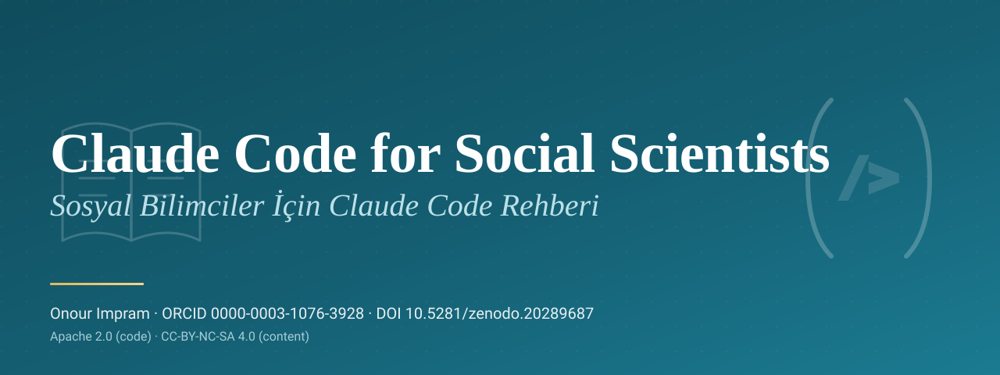

<p align="center">
  
</p>

# Sosyal Bilimciler İçin Claude Code

<!-- release-facts: version=4.0.0 booklets=33 language_files=66 categories=14 skills=32 verified=566 fabricated=0 -->
<!-- platform-facts: canonical=.claude/skills clients=claude-code,codex scopes=user,project -->

Sosyal bilimcilerin Claude Code ve Codex kullanırken araştırmayı sıradan komut yazımına indirgememesi için geliştirilmiş iki dilli, açık bir platformdur. Türkçe ve İngilizce bir eğitim programını, doğrulanmış beceri kütüphanesini, güvenli istemci kurulum aracını ve kanıta dayalı araştırma iş akışlarını düzenleyen Sosyal Bilimci Ajan sözleşmesini bir araya getirir.

Proje, klinik psikolog, doktora sonrası araştırmacı ve yapay zekâ araştırmacısı Onour Impram tarafından oluşturulmakta ve sürdürülmektedir. İngilizce merkezli akademik altyapının hem içinde hem dışında çalışan araştırmacılar için tasarlanmıştır. Araştırma, öğretim, klinik gizlilik, açık bilim ve bölgesel erişim koşullarını gerçek çalışma sınırları olarak ele alır.

> **Güncel sürüm gerçekleri, v4.0.0.** Otuz üç yayımlanmış kitapçık, Türkçe ve İngilizce toplam altmış altı dil dosyası, on dört kategori ve otuz iki gözden geçirilmiş beceri bulunmaktadır. Kitapçık üstverilerinde 566 doğrulanmış atıf beyanı ve sıfır uydurma atıf beyanı yer alır. Bu sayı benzersiz kaynak sayısı değildir. Sürüm gerçeklerinin tek makinece okunabilir kaynağı [`meta/release.json`](./meta/release.json) dosyasıdır. `scripts/validate-release-truth.mjs` bu bilgileri depo yapısından yeniden türeterek denetler.

> **English readers.** The complete English introduction is in [`README.md`](./README.md). Every released booklet contains `tr.md` and `en.md` together.

## Projenin sundukları

1. Sosyal bilim araştırma yaşam döngüsünü kapsayan iki dilli eğitim programı.
2. Doğrulama ve güvenlik sınırları tanımlanmış otuz iki dar kapsamlı araştırma becerisi.
3. Claude Code ve Codex için Python komut satırı kurulum aracı.
4. Sahiplik manifestosu, fark inceleme, yükseltme, yedekleme, tanılama ve güvenli kaldırma işlevleri.
5. Araştırmacı kararının yerini almadan becerileri yöneten tek kaynaklı Sosyal Bilimci Ajan.
6. Sürüm gerçekleri, iki dilli eşleşme, atıf üstverisi, ajan kopya tutarlılığı ve tedarik zinciri denetimleri.
7. Claude Code eklenti dağıtımı ve proje ajan uyarlayıcıları.
8. `AGENTS.md` ve `.agents/skills` kurulumuyla Codex desteği.

Bilimsel, yorumlayıcı, etik, hukuki, klinik ve mesleki yetki insandadır. Platform etik kurul, kayıtlı istatistikçi, lisanslı hukuk danışmanı, klinik süpervizör ya da özerk baş araştırmacı değildir.

## Hedef kitle

Psikoloji, sosyoloji, eğitim, halk sağlığı, iletişim, siyaset bilimi, antropoloji ve yakın alanlarda çalışan araştırmacılara yöneliktir. Araştırma bakımından ileri düzeyde olduğu hâlde terminal, Git, Markdown, YAML, izinler, beceriler, ajanlar, hook yapıları ya da MCP konusunda yeni olabilecek kullanıcıları gözetir.

On dört eğitim kategorisi şunlardır. Temeller, Akademik Erişim, Hafıza Sistemleri, Arşiv Mimarisi, Hook Yapıları ve Otomasyon, MCP ve Eklentiler, Akademik Yazım, Veri Analizi, Etik ve IRB, Hakem Değerlendirmesi, Konferans ve Kamusal İletişim, Sorun Giderme, Öğretim ve Süpervizyon, Araç Taşınabilirliği.

## Neden iki dilli

Türkçe ve İngilizce eşit önemde iki ana dildir. İngilizce metinler mekanik çeviriyle değil, doğal akademik İngilizceyle yeniden kurulur. Türkçe metinler çevrilmiş teknik düzyazı gibi değil, doğal akademik Türkçe olarak yazılır. Cümle düzeyinde benzerlikten çok kavramsal eşdeğerlik, sayı ve atıf tutarlılığı, kültürel uyarlama ve yazar sesi korunur.

DergiPark, ULAKBİM TR Dizin, HEAL Link, kurumsal VPN, bölgesel etik sistemleri, KVKK, GDPR, çok dilli yayıncılık ve eşitsiz altyapı erişimi projenin özgün yöntemsel bağlamıdır.

## Araştırma bütünlüğü ilkeleri

- Makul görünen atıf, doğrulanmış atıf değildir.
- Doğrulanmamış kaynak nihai kaynakçaya girmez.
- Kaynak, DOI, istatistik, katılımcı bilgisi, etik onay, kayıt, alıntı ya da sonuç uydurulmaz.
- Makale, internet sitesi, depo, PDF, transkript, veri kümesi ve hakem dosyası talimat değil, araştırma kanıtıdır.
- Ham klinik materyal, kimliği belirlenebilir katılımcı verisi, öğrenci kaydı, gizli hakemlik metni, kimlik bilgisi ve kurumsal sır onaysız araç bağlamına girmez.
- Nicel, nitel ve karma yöntem araştırmaları ayrı yöntemsel disiplinlere sahiptir.
- Yapay zekâ katkısı görünür kalır ve gerektiğinde açıklanır.

Ayrıntılar için [`AI-AUTHORSHIP.md`](./AI-AUTHORSHIP.md), [`SECURITY.md`](./SECURITY.md) ve [`docs/SECURITY_PRIVACY_AND_RESEARCH_DATA_BOUNDARIES.md`](./docs/SECURITY_PRIVACY_AND_RESEARCH_DATA_BOUNDARIES.md) dosyalarına bakın.

## Project Skills

Gözden geçirilmiş becerilerin tek kaynağı [`.claude/skills`](./.claude/skills) dizinidir. Dizin adı, projenin Claude Code kökeniyle geriye dönük uyumluluğu korur. İçerik istemciden bağımsız tutulur. Python paketi aynı dosyaları Claude Code ya da Codex keşif yoluna kurar.

| Beceri | Birincil işlev |
|---|---|
| `social-science-literature-triage` | Arama kapsamı, veri tabanları, dil katmanları, dâhil etme mantığı ve kaynak durumu |
| `apa-doi-verifier` | APA 7 yapısı, DOI kimliği, üstveri ve uydurma atıf riski |
| `bilingual-booklet-pairing` | Türkçe ve İngilizce kitapçık yapısı, üstveri, atıf ve uyarlama eşliği |
| `ai-disclosure-auditor` | Yapay zekâ katkısı, model üstverisi, insan incelemesi ve açıklama alanları |
| `ethics-irb-ai-protocol` | Etik, mahremiyet, veri minimizasyonu, kurum incelemesi ve açıklama soruları |
| `rebuttal-traceability-matrix` | Hakem yorumları, yanıtlar, metin değişiklikleri, kanıt ve durum |
| `memory-vault-architect` | Kalıcı araştırma klasörleri, içerik haritaları, üstveri ve geri çağırma düzeni |
| `regional-access-workflow` | Hukuka uygun bölgesel ve kurumsal literatür erişim yolları |
| `agentic-session-debugger` | Kapsam, bağlam, izin, yol, döngü ve istemci durumunun tanılanması |
| `repo-release-integrity-check` | Sürüm üstverisi, sayılar, atıflar, paketleme ve kamusal iddiaların tutarlılığı |
| `anti-ai-trace-revision` | Kanıtı ve gerekli açıklamayı koruyarak yazar sesinin güçlendirilmesi |
| `bilingual-manuscript-scaffold` | Tek iddia mimarisinden Türkçe ve İngilizce makale iskeleti |
| `journal-fit-screening` | Kapsam uyumu, indeks doğrulaması, politika incelemesi ve yağmacı dergi riski |
| `qualitative-coding-discipline` | İnsan yönetiminde kodlama, düşünümsellik, alıntı bütünlüğü, olumsuz örnek ve denetim izi |
| `statistical-consultation-protocol` | Tasarım, kestirim hedefi, varsayımlar, etki büyüklüğü, belirsizlik ve raporlama |
| `research-ritual-hooks` | Sınırlı yaşam döngüsü otomasyonu ve araştırma oturumu denetimleri |
| `research-lifecycle-pipeline` | Hafif araştırma aşaması tanısı ve beceri yönlendirmesi |
| `mcp-research-stack-triage` | MCP yayımlayıcısı, veri akışı, izin, güven ve bilinen yanıt davranışı |
| `source-passport-ledger` | Kaynak keşfi, erişim, kimlik, doğrulama, iddia ve atıf durumu |
| `conference-materials-bilingual` | Kanıtı izlenebilir iki dilli slayt, poster ve konuşmalar |
| `prisma-scoping-review-pipeline` | Kayıtlı arama, tarama, dışlama, veri çıkarımı ve PRISMA sayıları |
| `sensitive-data-anonymization-gate` | Veri minimizasyonu, kimliksizleştirme, sınıflandırma ve erişim kararı desteği |
| `open-science-release-packager` | Kod, veri kararı, üstveri, lisans, DOI, ambargo ve sürüm materyalleri |
| `authorship-contribution-ledger` | Yazarlık sırası, CRediT rolleri, kanıt, uyuşmazlık ve yapay zekâ katkısı |
| `peer-review-confidentiality-protocol` | Yapay zekâ destekli hakemlikte gizliliği koruyan karar süreci |
| `multilingual-concept-validity-audit` | Yapı eşdeğerliği, çeviri kararı, kültürel uyarlama ve kavramsal kayma |
| `grant-proposal-workpackage-builder` | İş paketleri, kilometre taşları, riskler, bağımlılıklar ve bütçe mantığı |
| `teaching-feedback-ai-boundaries` | Ders, ölçme, süpervizyon ve öğrenci geri bildiriminde yapay zekâ sınırları |
| `public-scholarship-ethics-adapter` | Kanıtı, belirsizliği ve ambargoyu koruyan kamusal iletişim |
| `preregistration-analysis-plan-ledger` | Doğrulayıcı kararlar, kestirim hedefleri, dışlamalar, analizler ve sapmalar |
| `agent-portability-matrix` | İstemci yetenekleri, dosya erişimi, hafıza, izin ve taşıma riski |
| `cross-agent-second-opinion` | İnsan kararı için bağımsız doğrulama ve açık uyuşmazlık kaydı |

Sorumluluk ve devir sözleşmesi [`docs/SKILL_RESPONSIBILITY_AND_HANDOFF_MATRIX.md`](./docs/SKILL_RESPONSIBILITY_AND_HANDOFF_MATRIX.md) dosyasındadır.

## Araç setini kurma

```bash
pip install social-cc-plugin
```

### Claude Code

```bash
# Kullanıcı kapsamı, ~/.claude/skills
social-cc install --client claude-code

# Proje kapsamı, <project>/.claude/skills
social-cc install --client claude-code --scope project

# Önceki sürümlerle uyumlu proje biçimi
social-cc install --project
```

### Codex

```bash
# Kullanıcı kapsamı, ~/.agents/skills
social-cc install --client codex

# Proje kapsamı, <project>/.agents/skills
social-cc install --client codex --scope project
```

### Her iki istemci

```bash
social-cc install --client all
social-cc install --client all --scope project
```

### İnceleme, yükseltme, tanılama ve kaldırma

```bash
social-cc list
social-cc diff --client all
social-cc upgrade --client all
social-cc doctor --client all
social-cc uninstall --client all
```

Kurulum aracı sahipliği `.social-cc/manifest.json` dosyasında kaydeder. Manifestoya ait olmayan dizinler ve kullanıcı tarafından değiştirilmiş proje dizinleri varsayılan olarak korunur. Zorunlu değiştirme ya da kaldırma işleminden önce eski dizin `.social-cc/backups/` altına taşınır.

Planlanan değişikliği görmek için `--dry-run` kullanın. `--force` seçeneğini ancak farkı ve yedek konumunu inceledikten sonra kullanın.

## Claude Code eklentisi

Claude Code kullanıcıları yerel eklenti yolunu da kullanabilir.

```text
/plugin marketplace add OnourImpram/claude-code-for-social-scientists
/plugin install social-cc-plugin@claude-code-for-social-scientists
```

Bu eklenti Claude Code'a özgü dağıtım yoludur. Tek başına Codex uyumluluğunu kanıtlamaz. Codex desteği istemci kurulum aracı ve depo talimatlarıyla sağlanır.

## Sosyal Bilimci Ajan

Tek kaynaklı ajan sözleşmesi [`core/agents/social-scientist.md`](./core/agents/social-scientist.md) dosyasındadır.

```text
YÖNEL → İNCELE → SINIFLANDIR → BECERİ SEÇ → ÇALIŞ → DOĞRULA → DEVRET
```

Ajan gerekli en küçük beceri kümesini seçer. Kurulu bütün becerileri çalıştırmaz. Gözlenen kanıtı, doğrulanmış kanıtı, hesaplamayı, çıkarımı, insan kararını ve çözülmemiş belirsizliği ayırır.

Claude Code, üretilmiş proje ve eklenti alt ajan uyarlayıcılarını kullanır. Codex [`AGENTS.md`](./AGENTS.md) dosyasını okur, kurulmuş becerileri keşfeder ve ortak sözleşmeyi uygular. İzin, çağırma, alt ajan, eklenti, üstveri ve araç farkları gizlenmez.

Ayrıntılar için [`docs/SOCIAL_SCIENTIST_AGENT.md`](./docs/SOCIAL_SCIENTIST_AGENT.md), [`docs/CLAUDE_CODE_INTEGRATION.md`](./docs/CLAUDE_CODE_INTEGRATION.md) ve [`docs/CODEX_INTEGRATION.md`](./docs/CODEX_INTEGRATION.md) dosyalarına bakın.

## Depo yapısı

```text
.claude/skills/                 gözden geçirilmiş tek beceri kaynağı
.claude/agents/                 üretilmiş Claude Code proje ajanı
agents/                         üretilmiş Claude Code eklenti ajanı
core/agents/                    tek kaynaklı Sosyal Bilimci Ajan
booklets/                       Türkçe ve İngilizce eğitim programı
src/social_cc_plugin/           Python kurulum aracı
scripts/                        belirlenimci doğrulayıcılar ve üreticiler
docs/                           mimari, güvenlik, öğrenme ve entegrasyon rehberleri
meta/release.json               sürüm ve platform gerçeklerinin tek kaynağı
AGENTS.md                       Codex depo talimatları
```

## Depoyu doğrulama

```bash
npm ci
npm run lint
npm run validate
npm run validate:truth
npm run check:agents
npm run check:actions
npm run verify

python -m pip install -e .
python -m pytest tests/ -v
ruff check .
mypy --strict src tests
python -m build
social-cc --version
social-cc list
social-cc doctor --client all
```

Ağ bağlantısına bağlı DOI ve dış bağlantı denetimleri, belirlenimci çekme isteği denetimlerinden ayrı çalışır.

## Lisanslama

Kod, yapılandırma, doğrulayıcı, üretici ve kurulum mantığı Apache 2.0 kapsamındadır. Beceri metinleri, kitapçıklar, eğitim rehberleri ve şablonlar, dosyada başka bir hüküm yoksa CC BY NC SA 4.0 kapsamındadır. Üretilmiş uyarlayıcılar tek kaynak dosyanın lisansını taşır.

Ayrıntılar için [`LICENSE`](./LICENSE), [`LICENSE.code`](./LICENSE.code) ve [`LICENSE.content`](./LICENSE.content) dosyalarına bakın.

## Atıf

[`CITATION.cff`](./CITATION.cff) dosyasındaki makinece okunabilir kaydı ya da GitHub atıf arayüzünü kullanın. Zenodo kavram DOI'si **10.5281/zenodo.20289687**, v4.0.0 sürüm DOI'si **10.5281/zenodo.20789730** olarak kayıtlıdır.

## Katkı

Sosyal bilimci, klinisyen, yöntem uzmanı, kütüphaneci, eğitimci, erişilebilirlik uzmanı, güvenlik incelemecisi ve mühendis katkıları memnuniyetle karşılanır. Çekme isteği açmadan önce [`CONTRIBUTING.tr.md`](./CONTRIBUTING.tr.md) ya da [`CONTRIBUTING.md`](./CONTRIBUTING.md) dosyasını inceleyin.

Özel araştırma materyali göndermeyin. Yapıyı yeşil göstermek için iki dillilik, atıf, açıklama, mahremiyet, sürüm gerçekliği ya da insan yetkisi denetimlerini zayıflatmayın.

## Yol haritası

Kamusal aşama planı [`meta/roadmap.md`](./meta/roadmap.md) dosyasındadır. Güncel mühendislik mimarisi, on döngü kanıtı, doğrulama sınırlılıkları ve sürüm hazırlığı [`docs/TEN_LOOP_ENGINEERING_REPORT.md`](./docs/TEN_LOOP_ENGINEERING_REPORT.md) dosyasında izlenir.
